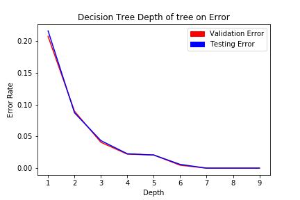
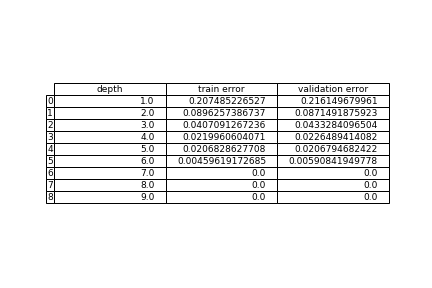
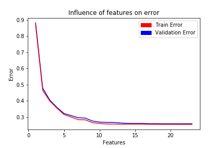
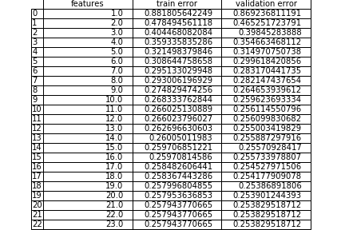
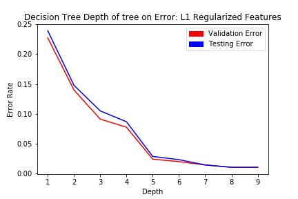
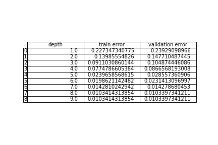
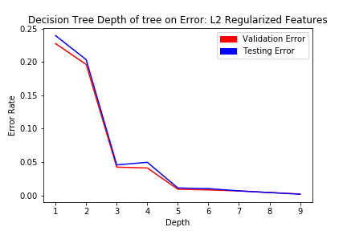
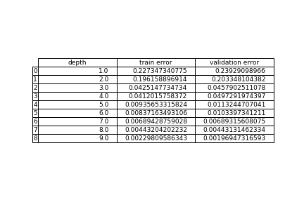
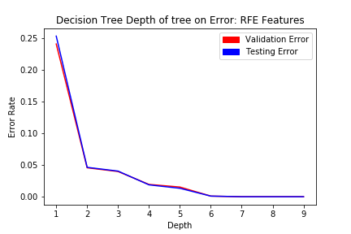
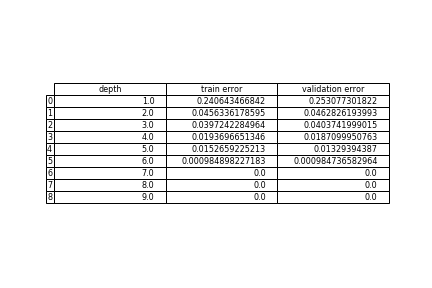

# Mushroom Toxicity Analysis
### Written by: Ted Haley
#### January, 2018

## Introduction
Mushrooms are a delicious edible fungus that are used in a variety of foods, however some varieties of fungus can be toxic to humans. The mushroom dataset that I will analyze in this report includes various features of toxic and non-toxic mushrooms. The goal of this project is to determine which features are relevant or irrelevant when determining the toxicity of a mushroom with a particular set of features. 

## Analysis
The mushroom dataset includes 22 features and a single binary classifier (toxic or non-toxic). Predictors include cap shape, cap surface, odor, stalk shape, colour, etc. In this analysis, I will try to determine which features are irrelevant in classifying the toxicity of the mushroom.

The data that I imported consists of categorical labels. I encoded these labels onto a numeric scale so I can interpret them analytically using various feature and model selection tools.

Before I initiate a feature selection, I will first look at the existing parameters to see how they perform when classifying the toxic mushrooms. Below is a decision tree that is fit over various depths.

I decided to use a decision tree classifier to perform my initial exploratory data analysis because decision trees tend to overfit on data with a large number of features. That being said, the decision tree should see the largest improvement with a reduction in the number of features.

Figure 1: Decision Tree:  




From the results above, we can see that both the training error and validation error are 0 with a depth of 7. This is useful to know, as a combination of 7 individual features resulted in an error of 0. We could expect the number of useful features to be in around 7.

The following analysis are the results of a Recursive Feature Elimination (RFE).  The RFE is using a ridge estimator that performs L2 regularization on the training data to determine the optimal number of features to use. The plot below shows the relationship between the number of features and the training and validation error of the model.

Figure 2: RFE: 




We can see from the results above that there is no significant decrease in validation or training error when we include more than approximately 9 or 10 features. This seems reasonable as the max depth for the decision tree was 7. To confirm our suspisions, we will perform a regularized logistic regression for both the L1 regualarization and L2 regularization below.

```
L1 Features Selected: 8     
L1 Score: 0.954702117184      
L1 Test Error Rate: 0.0452978828163 
 
L2 Features Selected: 7  
L2 Score: 0.944854751354  
L2 Test Error Rate: 0.055145248646
```

As I had suspected, the L1 and L2 logistic regression resulted in 8 and 7 features selected, respectively. For the L1, L2, and RFE reductions I have found above, I will now apply the selected features to the training data and refit the decision tree classifier from figure 1.

Figure 3: Decision Tree with L1 Features: 




We can see above that the L1 Regularized features actually led to an increase in the error rate with respect to the unregularized dataset (marginal increase). This is an interesting result as I would have expected the validation error to be lower.


Figure 4: Decision Tree with L2 Features: 




We can see above that the L2 reduced features performed well with the decision tree of depth 3. This is an improvement over the decision tree using all 23 features shown in figure 1. This reduced model shows that the 7 features selected in conjunction with a decision tree of depth 3 has a 95% accuracy for both the training and validation data.


Figure 5: Decision Tree with RFE features: 




The decision tree using the RFE features shows the most improvement over the full feature set, achieving a 100% accuracy score for both the training and validation data with a tree of depth 7. As previously mentioned, the optimal tree depth using all features was 7, so this proves that the combination of these 10 features selected from the RFE feature selection in conjunction with a depth of 7, results in the best model and feature combination.


## Conclusion
As the analysis above has shown, there are a variety of features from the mushroom dataset that are irrelvant when determining if a mushroom is toxic. The model and features that result in the best overall combination are a decision tree of depth 7, with 10 features selected from RFE using the ridge estimator, resulting in a classification accuracy fo 100%.  
